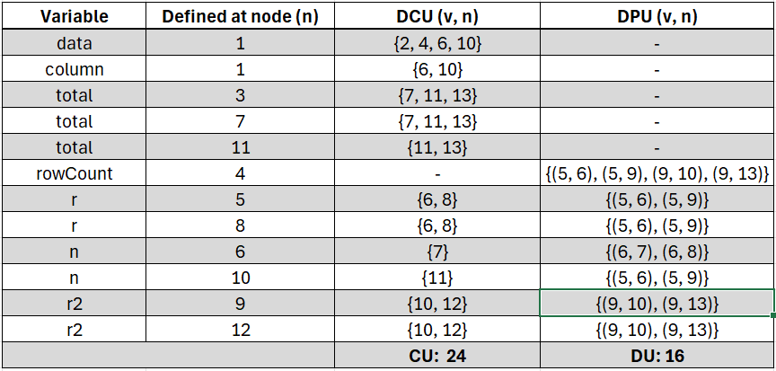
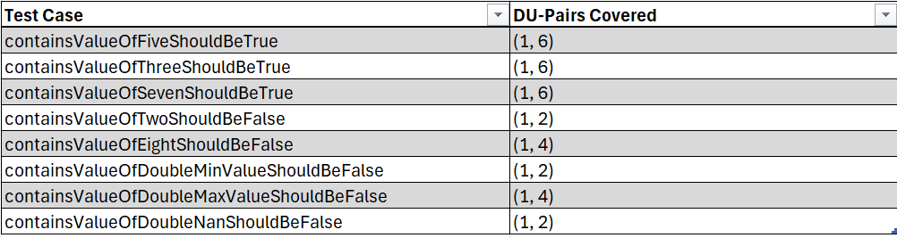

**SENG 637 - Dependability and Reliability of Software Systems**

**Lab. Report #3 – Code Coverage, Adequacy Criteria and Test Case Correlation**

| Group: 9               |
| ---------------------- |
| Moaz Barakat           |
| Juan Celis             |
| Bogdan Constantinescu  |
| Andy Guevara           |
| Billy Sidharta         |

(Note that some labs require individual reports while others require one report
for each group. Please see each lab document for details.)

# 1 Introduction

This assignment is about understanding the basics of coverage based testing, effectiveness of white-box testing and using coverage tools in a practical experience. In this assignment specifically, the system under test (SUT) is a modified version of JFreeChart which is an open-source Java framework for charts. We are required to use code coverage tools to measure test adequacy.

The following were used to complete this assignment:

- IDE: Eclipse (2023)
- Unit testing: JUnit 4.x
- Mocking: Jmock
- Coverage tool: EclEmma

Additionally, the assignment aims to help us understand how data-flow coverage works and calculate it manually by hand. By completing the assignment, we should have an idea of some of the trade-offs that occur when choosing different test suite adequacy criteria for testing.

# 2 Manual data-flow coverage calculations for X and Y methods

In this section, we are required to manually complete the data flow coverage graph (DFG) and calculations for two methods. The first method (X) was required to be DataUtilities.calculateColumnTotal. The second method we chose was Range.contains (Y). Below are the manual work for both methods as per assignment instructions:

## calculateColumnTotal

### DFG

### Def-use sets per statement

**Defs**:
- def(1) = `{data, column}`
- def(3) = `{total}`
- def(4) = `{rowCount}`
- def(5) = `{r}`
- def(6) = `{n}`
- def(7) = `{total}`
- def(8) = `{r}`
- def(9) = `{r2}`
- def(10) = `{n}`
- def(11) = `{total}`
- def(12) = `{r2}`

**Uses**:
- use(2) = `{data}`
- use(4) = `{data}`
- use(5) = `{r, rowCount}`
- use(6) = `{data, r, column, n}`
- use(7) = `{total, n}`
- use(8) = `{r}`
- use(9) = `{r2, rowCount}`
- use(10) = `{data, r2, column, n}`
- use(11) = `{total, n}`
- use(12) = `{r2}`
- use(13) = `{total}`

### All DU-pairs per variable
- data: `(1, 2), (1, 4), (1, 6), (1, 10)`
- column: `(1, 6), (1, 10)`
- total: `(3, 7), (3, 11), (3, 13), (7, 11), (7, 13), (11, 13)`
- rowCount: `(4, 5), (4, 9)`
- r: `(5, 5), (5, 6), (5, 8), (8, 8)`
- n: `(6, 6), (6, 7), (6, 10), (6, 11), (10, 10), (10, 11)`
- r2: `(9, 9), (9, 10), (9, 12), (12, 12)`

### DU-pairs Coverage

**All-uses coverage**:
- CU = `24`
- PU = `16`
- CUc  = `8`
- PUc  = `16`
- CUf  = `14`
- PUf  = `0`
- AUC = (CUc + PUc) / [ (CU + PU) - (CUf + PUf) ] = (8 + 16) / [ (16 + 24) - (14 + 0) ] = 24 / 26 = 92.3%

## contains

### DFG

### Def-use sets per statement

**Defs**:
- def(1) = `{value}`

**Uses**:
- use(2) = `{value, this.lower}`
- use(4) = `{value, this.upper}`
- use(6) = `{value, this.upper, this.upper}`

### All DU-pairs per variable
- value: `(1, 2), (1, 4), (1, 6)`

### DU-pairs Coverage

**All-uses coverage**:
- CU = `0`
- PU = `4`
- AUC = (CUc + PUc) / [ (CU + PU) - (CUf + PUf) ] = 100%

# 3 A detailed description of the testing strategy for the new unit test

For this assignment, our plan and strategy was to produce new units test that were based on visualizing and hitting all possible paths by creating Control Flow Graphs (CFGs). The CFGs for the methods were created using code2flow.com as suggested per lecture material. A sample CFG is provided below for the contains method. Additionally, we followed the same format as per assignment #2 to generate test cases so that we can meet the minimum coverage requirements. It is worth to mention that our coverage from our original tests in assignment 2 had mostly >50% coverage and 100% coverage in some cases.

Note: The assignment instructions state that the classes under test must have a minimum coverage percent. The two classes are Range/DataUtilities. We wanted to outline two important observations:

- For the Range class, we only chose 5/15 methods to unit test as per assignment 2 guidelines. It was unclear if the minimum coverage outlined in this assignment instructions should be for just the 5 methods or for the entire Range class. We saw this as an opportunity to go above and beyond and practice doing more unit tests. Therefore, we have created multiple tests similar to assignment 2 to ensure the minimum coverage is met in the worse case. If this was the intention of the instructions, then the recommendation is to make this more clear in the instructions.
- The Range/DataUtilities had more methods that were not in the javadoc provided in assignment 2. Some of the additional functions we observed were overloading functions (E.g DataUtilities.calculateColumnTotal), object class functions (E.g DataUtilities.clone), and brand new class methods (E.g Range.Scale). Similarly, we focused on ensuring we meet the minimum coverage for the worse case.

Sample CFG produced of contains method:

# 4 A high level description of five selected test cases you have designed using coverage information, and how they have increased code coverage

Note minimum **required** coverage specified from assignment:
- Instruction: `90.0 %`
- Branch: `70.0 %`
- Method: `60.0 %`

## 1 - DataUtilitiesTest.calculateColumnTotalShouldHaveErrorForNegativeOneRows()

Coverage result (from A2):

This test case was created to improve the coverage of the calculateColumnTotal method in the DataUtilities class. The initial test coverage for the method from assignment 2 was:

- Instruction: `72.9 %`
- Branch: `62.5 %`
- Method: `100.0 %`

This coverage did not meet the minimum coverage requirements as specified in the assignment. Specifically, the second for loop in the method was never stepped into since rows > 0 for all of our tests. To improve the instruction and branch coverage, we added this test case which specifies a negative value of rows so that we are able to reach that second for loop. Furthermore, we'ved used both null and non-null values for mocking the getValue method to cover more branches. Note that the second for loop leads to an infinite loop since `r2` is incremented instead of decremented. Thus, we expect an error to be thrown as it will lead to infinite number of mocking invocations/eventual timeout. Additionally, we also added another test for 0 number of rows to ensure we have covered all of our edge cases.

The result is the following coverage improvement which meets/exceeds the minimum requirements:

- Instruction: `100.0 %`
- Branch: `100.0 %`
- Method: `100.0 %`

## 2 - DataUtilitiesTest.calculateRowTotalShouldHaveErrorForNegativeOneColumns()

Coverage result (from A2):

Similar to the test above, this test case was created to improve the coverage of the calculateRowTotal method in the DataUtilities class. The initial test coverage for the method from assignment 2 was:

- Instruction: `72.9 %`
- Branch: `62.5 %`
- Method: `100.0 %`

This coverage did not meet the minimum coverage requirements as specified in the assignment. Specifically, the second for loop in the method was never stepped into since columns > 0 for all of our tests. To improve the instruction and branch coverage, we added this test case which specifies a negative value of columns so that we are able to reach that second for loop. Furthermore, we'ved used both null and non-null values for mocking the getValue method to cover more branches. Note that the second for loop leads to an infinite loop since `r2` is incremented instead of decremented. Thus, we expect an error to be thrown as it will lead to infinite number of mocking invocations/eventual timeout. Additionally, we also added another test for 0 number of columns to ensure we have covered all of our edge cases.

The result is the following coverage improvement which meets/exceeds the minimum requirements:

- Instruction: `100.0 %`
- Branch: `100.0 %`
- Method: `100.0 %`

## 3 - DataUtilitiesTest.getCumulativePercentagesShouldHaveErrorForNegativeCount()

Coverage result (from A2):

Similar to the tests above, this test case was created to improve the coverage of the getCumulativePercentages method in the DataUtilities class. The initial test coverage for the method from assignment 2 was:

- Instruction: `85.2 %`
- Branch: `58.3 %`
- Method: `100.0 %`

This coverage did not meet the minimum coverage requirements as specified in the assignment. Specifically, the second for loop in the method was never stepped into since item count was >= 0 for all of our tests. To improve the instruction and branch coverage, we added this test case which specifies a negative value of item counts so that we are able to reach that second for loop. Furthermore, we'ved used both null and non-null values for mocking the getValue method to cover more branches. Note that the second for loop leads to an infinite loop since `i2` is incremented instead of decremented. Thus, we expect an error to be thrown as it will lead to infinite number of mocking invocations/eventual timeout.

The result is the following coverage improvement which meets/exceeds the minimum requirements:

- Instruction: `100.0 %`
- Branch: `83.3 %`
- Method: `100.0 %`

## 4 - DataUtilitiesTest.getCumulativePercentagesSameLengthWithNullShouldBeTrue()

Coverage result (from A2):

Similar to the test above, this test case was created to improve the coverage of the getCumulativePercentages method in the DataUtilities class. After implementing the getCumulativePercentagesShouldHaveErrorForNegativeCount test above this resulted in:

- Instruction: `100.0 %`
- Branch: `83.3 %`
- Method: `100.0 %`

Although this coverage meets the minimum requirements, we still decided to include this test to cover the edge case of null values. This tests introduces a null value to improve branch coverage by reaching the two if statements.

The result is the following coverage improvement which meets/exceeds the minimum requirements:

- Instruction: `100.0 %`
- Branch: `100.0 %`
- Method: `100.0 %`

## 5 - RangeTest.rangeInitializationShouldFailWithInvalidRange()

Coverage result (from A2):

This test case was created to improve the coverage of the constructor in the Range class. The initial test coverage for the method from assignment 2 was: 

- Instruction: `40.6 %`
- Branch: `50.0 %`
- Method: `100.0 %`

This coverage did not meet the minimum coverage requirements as specified in the assignment. Specifically, we noticed that we never tested our constructor with an invalid range. By testing an invalid range with a lower > upper, we improve both the instruction and branch coverage.

The result is the following coverage improvement which meets/exceeds the minimum requirements:

- Instruction: `100.0 %`
- Branch: `100.0 %`
- Method: `100.0 %`

# 5 A detailed report of the coverage achieved of each class and method (a screen shot from the code cover results in green and red color would suffice)

## DataUtilities

### Statement Coverage

### Branch Coverage

### Method Coverage

## Range

### Statement Coverage

Note that this is very close to the minium coverage for the overall class. For methods tested in assignment 2, this exceeds the minimum coverage. As proven by the screenshot above, the only coverage we missed was related to the get methods. We think these have infeasible/unreachable paths as the constructor always triggers the IllegalArgumentException before we are able to call the get method on an invalid ranges. Additionally, there are no set methods and the variables were private, therefore we could not force the instruction coverage for these methods specifically.

### Branch Coverage

### Method Coverage

# 6 Pros and Cons of coverage tools used and Metrics you report

In this assignment, we used the assignment recommended coverage tool EclEmma which is a free Java code coverage tool. There were various reasons why we went with EclEmma, some of the pros include:

**Pros**:
- Accessibility: The tool is available in the Eclipse marketplace and could be installed/updated from within Eclipse. In our case, Eclipse 2023 had EclEmma already installed making it very accessible and usable directly from the workbench.
- Various metrics: The tool provides a variety of coverage metrics which were required for this assignment (statement, branch and method). Some of the other tools we looked into (E.g Clover) did not provide the variety that EclEmma provided
- Aesthetics: We all really liked the color coding and illustration that EclEmma provided. This helped us focus on what we needed to look at.
- Results: Coverage results are summarized in a tabular format within Eclipse. We liked how it was organized and how the results were presented.

Although EclEmma was a good coverage tool, there were still some cons associated with the tool. Some of the cons include:

**Cons**:
- Branch coverage: there was no information on which particular branch was missed. This makes it harder to see which ones are already covered and which ones requires additional testing.
- Although not used in this assignment, we did not see a condition coverage metric that we learned about in the lectures.

Overall, we thought EclEmma was the right coverage tool to use for this assignment as the pros outweighed the cons.

# 7 A comparison on the advantages and disadvantages of requirements-based test generation and coverage-based test generation.

Both the requirements-based test generation and coverage-based test generation have their advantages and disadvantages. Below are some of the advantages/disadvantages we observed:

## Requirements-Based Test Generation

### Advantages

- Tests are generated from system requirements and specifications without knowing the implementation of the code. This makes testing simpler for example we can directly test boundaries and test the software in a non biased manner.
- Tests do not require any special coverage tools. This means testing against the requirements can be done at an early stage which could reduce potential issues in the future if errors are caught early on the development
- Tests identify if the high-level software fulfills its intended purpose as we are not concerned about the design of the software

### Disadvantages

- Tests generated rely heavily on a well written specifications and requirements. If the specifications are lacking or are not well defined, the generated tests will not provide good indication of whether the software purpose is fulfilled
- Tests generated without knowing the implementation may result in missing important edge cases and unintentional bugs even with boundary testing technique applied
- There could generally be gaps in testing if *only* requirements-based test generation is performed without Coverage-Based Testing
- As stated in lecture, test suite size can grow very rapidly with high number of categories

## Coverage-Based Test Generation

### Advantages

- Coverage based testing ensures that the code is extensively covered as we can aim to achieve a high coverage of various metrics such as statement, branch, and method coverage. This can help create targeted unit tests.
- Coverage based testing can potentially be used as a tool for code improvement as it can tell us how complex our code is to and how much of the code is run.
- Coverage based testing could identify potential issues early on in the development ensuring that the final product is more robust and resilient

### Disadvantages

- As stated in lectures, high coverage for various metrics does not guarantee bug-free software. We may be tricked into thinking the code is bug free with such high coverage
- Coverage based testing does not guarantee a functionally correct software
- Coverage based testing can lead to testing irrelevant parts of the code to ensure the coverage is high

# 8 A discussion on how the team work/effort was divided and managed

Similar to assignment 2, the manual calculations, test plan, and strategy was developed together from all team members. Afterwards, we split into two groups to carry out all the tests. Each of the group member created the CFGs for the methods they were dealing with. The first group focused on the Range class while the second group focused on the DataUtilities class. Once both groups have completed their testing, we scheduled a peer review meeting to go over the issues found from each group. The meeting was used to discuss consistent severity and priority ratings, reproducibility procedure formatting and removed any duplicate issues that were found by both teams. 

Group 1: Bogdan and Andy

Group 2: Juan, Billy and Moaz

# 9 Any difficulties encountered, challenges overcome, and lessons learned from performing the lab

In this assignment, none of our group members had previous experience with using EclEmma or other coverage tools which was a challenge. There was a learning curve to learn how the coverage tool functions, get aquatinted with the user interface and how to use it effectively to develop the tests. Ultimately, we got comfortable with the layout and saw how helpful the tool was and overcame that challenge. Additionally, we also faced an issue in figuring out the branch coverage that was missed. This is when we realized that the tool only outlines the number of branches missed instead of what was missed. We ultimately learned this was a limitation of the tool and continued to use the tool effectively. 

# 10 Comments/feedback on the lab itself

We all thought the lab was very helpful as it exposed us to coverage based testing. Additionally, we also thought the instructions of the lab was structured well. 
